# Enhancing Trust in Digital Waqf Platforms through Machine Learning-Based Fraud Detection

## Abstract
Digital waqf platforms improve accessibility, transparency, and efficiency, but they also increase exposure to transaction fraud that can weaken donor confidence and institutional credibility. This study develops a machine learning fraud detection framework using a CRISP-DM workflow and evaluates it in a proxy setting with extreme class imbalance. Four models were compared: Random Forest, XGBoost, Isolation Forest, and Autoencoder. On calibrated holdout evaluation, XGBoost achieved the strongest overall balance (Precision 0.927711, Recall 0.810526, F1 0.865169, ROC-AUC 0.975017, PR-AUC 0.822634), while Random Forest achieved the highest precision (0.985507) with the lowest false positive count (1). To improve reliability beyond a single split, repeated stratified cross-validation (5 folds x 3 seeds, 15 runs per model) and pairwise statistical testing were conducted. Cross-validation confirmed ranking stability (XGBoost mean F1 0.846980 +/- 0.022275; Random Forest mean F1 0.834087 +/- 0.043353). Welch tests showed no significant F1 difference between XGBoost and Random Forest (p = 0.317325), while both significantly outperformed unsupervised models (p < 0.001). Findings support a layered governance design for digital waqf: supervised detection as primary screening and anomaly models as secondary surveillance. Because the dataset is a non-waqf proxy with anonymized features, claims are methodological and governance-oriented rather than direct operational deployment evidence.

Keywords: digital waqf, fraud detection, machine learning, CRISP-DM, fintech governance

---

## 1. Introduction
Digital transformation in waqf management can improve accountability and operational reach. However, digital transactions also create fraud risks that may harm trust among donors, managers, and beneficiaries. In high-volume transaction systems, manual monitoring is insufficient, especially when fraud events are rare.

Machine learning can support fraud detection under severe class imbalance, but public waqf-specific fraud datasets are unavailable. Therefore, this research uses a proxy fraud dataset to establish a reproducible methodological baseline and governance interpretation for digital waqf platforms (Oduro et al., 2025; Vangibhurathachhi, 2025; Phua et al., 2010).

This paper makes three integrated contributions. First, it implements an end-to-end CRISP-DM pipeline with reproducible artifacts. Second, it performs a comparative evaluation of supervised and unsupervised fraud detection models under one consistent workflow. Third, it strengthens empirical credibility through repeated stratified cross-validation and pairwise statistical significance testing.

The study is guided by three research questions. RQ1 asks which model provides the most reliable precision-recall trade-off for fraud detection in an extreme-imbalance proxy dataset for digital waqf. RQ2 examines whether anomaly detection can complement supervised learning in a layered fraud-monitoring architecture. RQ3 investigates how model outputs can be translated into an applied governance-and-trust framework for digital waqf platforms.

To ground these contributions, the next section first positions this study in existing literature, then maps the empirical context and methodological design.

---

## 2. Literature Review and Novelty Positioning

This section positions the study against prior fraud-detection literature and explicitly states what is new in the current manuscript.

### 2.1 Prior Work in Financial Fraud Detection
Two core references available in this project emphasize the strength of AI/ML for financial fraud detection. Oduro et al. (2025) discuss AI-powered fraud detection in digital banking through a literature-review approach and highlight supervised learning, anomaly detection, explainability, and governance concerns. Vangibhurathachhi (2025) presents supervised, unsupervised, and deep-learning approaches for financial fraud detection with emphasis on scalability, real-time detection, and implementation challenges.

Across both references, the common conclusion is that machine learning generally outperforms static rule-based systems for modern digital fraud environments (Oduro et al., 2025; Vangibhurathachhi, 2025).

### 2.2 Gap Identification
Based on the available references, four practical gaps remain for the current waqf-fintech context. The first is a domain gap, because prior papers focus on digital banking and general financial systems rather than digital waqf governance scenarios. The second is a reproducibility gap, as prior discussion in the provided documents is largely conceptual or review-oriented with limited end-to-end reproducible CRISP-DM artifacts. The third is a comparative evaluation gap, since supervised and unsupervised approaches are discussed broadly but rarely calibrated side by side within one consistent pipeline. The fourth is a statistical validation gap, because repeated cross-validation and pairwise significance testing are not central in the provided references.

### 2.3 Novelty of This Study
The novelty of this study is not a new algorithm; rather, it lies in a governance-oriented and reproducible design tailored to digital waqf risk management. Contextually, the study reframes fraud detection from generic financial security into trust, transparency, and governance requirements specific to waqf platforms. Methodologically, it implements a full CRISP-DM pipeline with auditable artifacts, including tables, plots, reports, and model files. At the evaluation level, it compares Random Forest, XGBoost, Isolation Forest, and Autoencoder within one calibrated workflow aligned with operational objectives. For validation, it adds repeated stratified cross-validation (5 folds x 3 seeds) and pairwise statistical testing. At the deployment-design level, it proposes layered governance use, with supervised models for primary screening and anomaly models for secondary surveillance.

### 2.4 Comparative Positioning Summary

| Dimension | Prior References (Available in Project) | This Study |
|---|---|---|
| Primary context | Digital banking / general financial fraud | Digital waqf governance proxy context |
| Study type | Largely literature/conceptual synthesis | Empirical, end-to-end CRISP-DM implementation |
| Model comparison | Broad family-level discussion | Unified comparison of 4 specific models |
| Reproducible artifacts | Not the focus in provided excerpts | Full artifact set saved to disk |
| Statistical robustness | Limited explicit repeated-CV evidence in provided excerpts | Repeated stratified CV + pairwise Welch testing |
| Governance translation | General security recommendations | Trust-transparency-governance framing for waqf fintech |

This positioning clarifies that the paper's contribution lies in rigorous, reproducible evaluation and domain-specific governance interpretation rather than proposing a novel ML architecture.

### 2.5 Dataset Justification (Why a Proxy Dataset Is Used)
Reviewer concern about dataset choice is valid and is addressed explicitly. A proxy dataset is used because waqf transaction fraud datasets are not publicly available in open research repositories, which prevents transparent and reproducible benchmarking on waqf-native data. In addition, the core detection mechanism investigated here concerns behavioral anomaly and class-imbalance learning, both of which are structurally transferable across digital transaction domains. Finally, the two project-available references also focus on non-waqf financial fraud contexts, indicating that proxy-domain experimentation is a common empirical pathway before domain-specific deployment.

Therefore, this paper frames conclusions as method-transfer and governance-design evidence, not as direct performance claims for live waqf production systems.

With novelty boundaries clarified, the next section details the research context and data profile used to operationalize the proposed pipeline.

---

## 3. Research Context and Data

This section narrows the problem from conceptual governance concerns to measurable data properties that shape modeling decisions.

### 3.1 Business Problem and Governance Objective
The core problem is how to detect suspicious digital transactions while simultaneously balancing fraud interception effectiveness, false-positive control to avoid unnecessary donor or operator friction, and transparency-oriented governance accountability in digital waqf operations.

Given these governance requirements, the following dataset profile explains the empirical constraints under which model performance should be interpreted.

### 3.2 Dataset Profile
The experiment uses a proxy transaction fraud dataset containing 284807 rows and 31 columns, with fraud prevalence of 0.001727. During profiling, 1081 duplicate records were identified, while missing values were not observed in the top missingness profile. This distribution confirms the expected rarity pattern of fraud events and justifies imbalance-aware evaluation choices (He and Garcia, 2009; Saito and Rehmsmeier, 2015).

After establishing the data profile, visual diagnostics are presented to show imbalance severity and feature relationships that motivate the modeling strategy.

### 3.3 Data Understanding Plots

Class imbalance visualization:

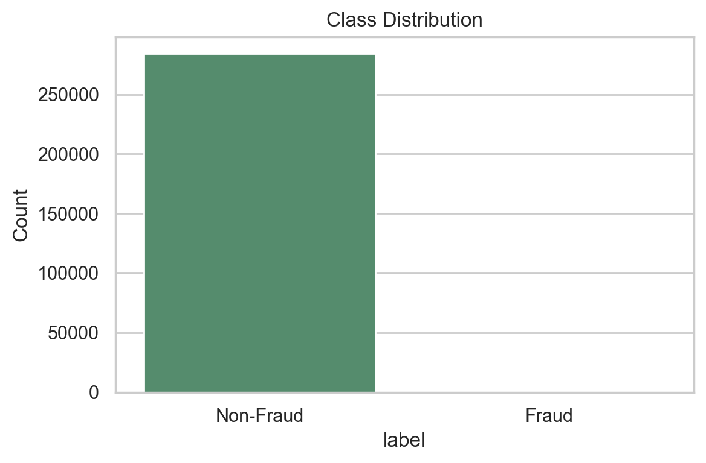

Figure 1. Class distribution in the proxy dataset.

Explanation: Figure 1 confirms severe imbalance between legitimate and fraudulent transactions. This condition motivates the use of PR-AUC, recall, and F1 as key indicators, because accuracy can be misleading when fraud incidence is extremely low.

Amount behavior by class:

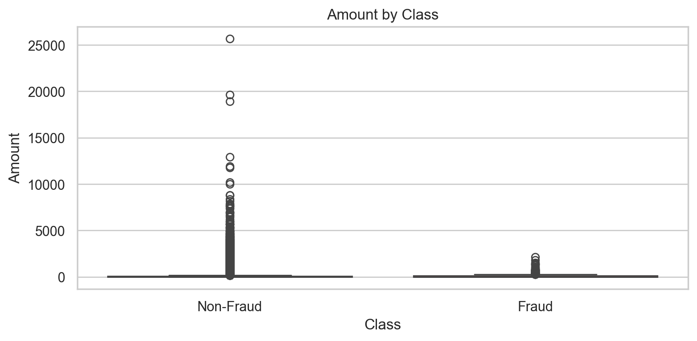

Figure 2. Transaction amount distribution by class.

Explanation: Figure 2 indicates overlap between fraud and non-fraud amount ranges. This implies that amount alone is not sufficient for robust detection and must be combined with multivariate behavioral signals.

Selected feature correlation map:

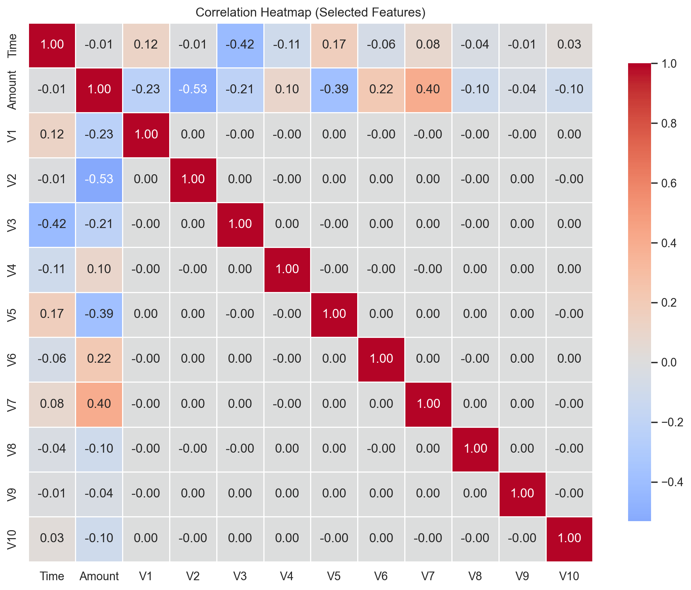

Figure 3. Correlation heatmap for selected features with per-cell coefficients.

Explanation: Figure 3 now reports numeric correlation values in each cell to improve interpretability. Most pairwise relationships are moderate, suggesting that models should capture non-linear interactions rather than relying only on strong linear dependencies.

With this empirical context established, the next section details the CRISP-DM implementation used to transform data understanding into a reproducible fraud detection pipeline.

---

## 4. Methodology (CRISP-DM)

The methodological flow follows a staged design so that each modeling decision can be traced back to observable data properties and governance objectives.

### 4.1 Data Preparation
The dataset was preprocessed by removing 1081 duplicate records, resulting in 283726 rows for modeling. All 30 non-target predictors were retained because no feature crossed the missingness-removal threshold. A stratified 80:20 split produced 226980 training rows and 56746 validation rows, while preserving class rarity (training fraud ratio: 0.001665; validation fraud ratio: 0.001674). The preprocessing pipeline applied median imputation and robust scaling, and the unsupervised branch was fit on normal transactions only. For supervised learning, class-weighting was used (class 0: 0.5008340614822464; class 1: 300.23809523809524) as an imbalance-aware alternative to naive resampling (He and Garcia, 2009; Chawla et al., 2002).

Building on this preparation, the model set was intentionally selected to compare label-driven classifiers against anomaly-driven detectors under identical data conditions.

### 4.2 Models
The comparative model set includes Random Forest and XGBoost for supervised learning, and Isolation Forest plus an autoencoder-based reconstruction detector for anomaly-oriented monitoring. This selection intentionally combines strong tabular classifiers with unsupervised detectors to support both labeled-pattern detection and emerging anomaly surveillance (Breiman, 2001; Chen and Guestrin, 2016; Liu et al., 2008; Chandola et al., 2009).

Because model outputs are sensitive to decision thresholds in imbalanced settings, threshold selection is treated as an explicit design step rather than a default setting.

### 4.3 Threshold Strategy
Thresholds were explicitly calibrated rather than fixed at default values. Random Forest used threshold 0.527 under a precision-priority objective, while XGBoost used threshold 0.415 under a recall-priority objective. For anomaly models, Isolation Forest used threshold 0.5769604030363915 from the 99th percentile of anomaly scores, and the autoencoder used threshold 0.8782194725058396 from the 99th percentile of reconstruction errors. This calibration strategy is consistent with best practices for imbalanced decision settings where threshold choice materially affects operational trade-offs (Davis and Goadrich, 2006; Saito and Rehmsmeier, 2015).

Calibration visualizations:

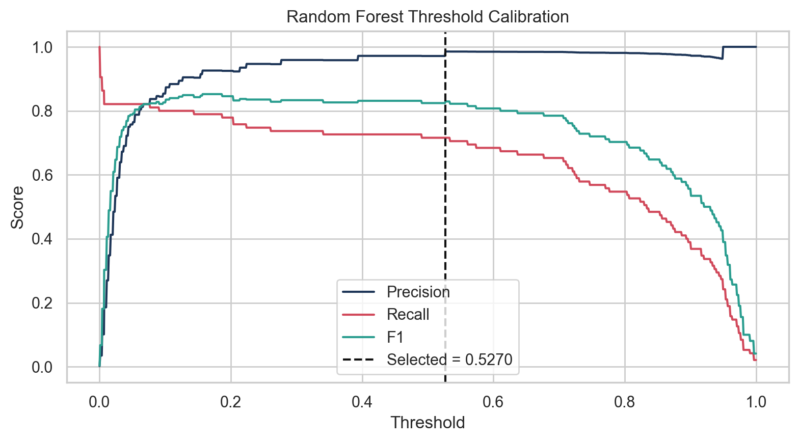

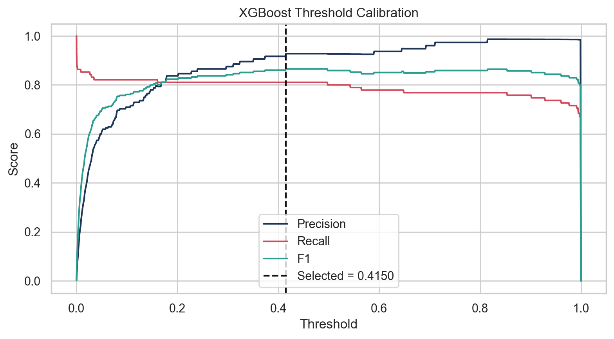

After completing calibration, the subsequent section reports performance outcomes in increasing depth: holdout metrics, error structure, curve behavior, robustness, and statistical significance.

---

## 5. Results

Results are organized progressively so readers can move from headline performance to reliability evidence without losing methodological continuity.

### 5.1 Holdout Results (Calibrated Validation Set)

Table 1 summarizes model performance on the calibrated holdout set. The key operational reading is that XGBoost provides the best precision-recall balance, while Random Forest minimizes false positives most aggressively.

| Model | Precision | Recall | F1 | ROC-AUC | PR-AUC | TN | FP | FN | TP | Threshold |
|---|---:|---:|---:|---:|---:|---:|---:|---:|---:|---:|
| XGBoost | 0.927711 | 0.810526 | 0.865169 | 0.975017 | 0.822634 | 56645 | 6 | 18 | 77 | 0.415000 |
| Random Forest | 0.985507 | 0.715789 | 0.829268 | 0.949074 | 0.807194 | 56650 | 1 | 27 | 68 | 0.527000 |
| Autoencoder | 0.115625 | 0.778947 | 0.201361 | 0.919420 | 0.550177 | 56085 | 566 | 21 | 74 | 0.878219 |
| Isolation Forest | 0.065053 | 0.452632 | 0.113757 | 0.931793 | 0.068572 | 56033 | 618 | 52 | 43 | 0.576960 |

Main comparative plot:

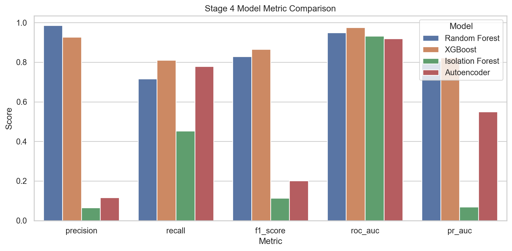

Figure 4. Multi-metric comparison across all models.

Explanation: Figure 4 visually confirms that supervised models dominate unsupervised alternatives in F1 and PR-AUC. This pattern is consistent with the availability of labeled fraud data in the proxy setting.

Final ranking plot:

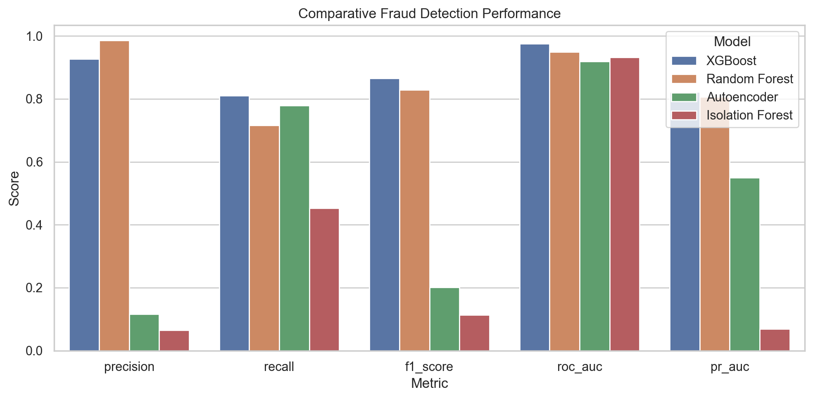

Figure 5. Final ranking-oriented model comparison.

Explanation: Figure 5 highlights the final ordering used in the governance narrative: XGBoost as primary candidate, Random Forest as precision-oriented alternative, and unsupervised models as secondary anomaly monitoring tools.

To make these aggregate scores operationally tangible, confusion matrices are discussed next at the error-count level.

### 5.2 Confusion Matrix Visuals

The confusion matrices are presented to make decision consequences explicit for practitioners. In a waqf governance context, false positives represent potential donor friction, while false negatives represent missed fraud risk.

Random Forest confusion matrix:

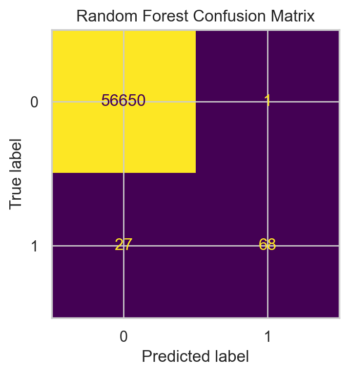

Figure 6. Random Forest confusion matrix.

Explanation: Random Forest yields very low false positives (FP = 1), which is desirable when institutional policy prioritizes minimizing unnecessary flags on legitimate activity.

XGBoost confusion matrix:

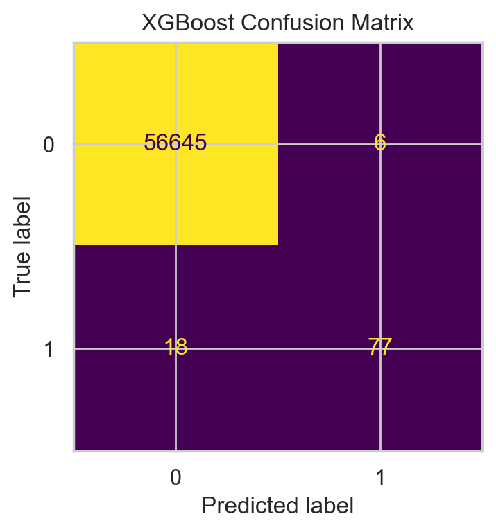

Figure 7. XGBoost confusion matrix.

Explanation: XGBoost captures more fraud cases (TP = 77) than Random Forest while keeping false positives low (FP = 6), making it a strong operational compromise.

Isolation Forest confusion matrix:

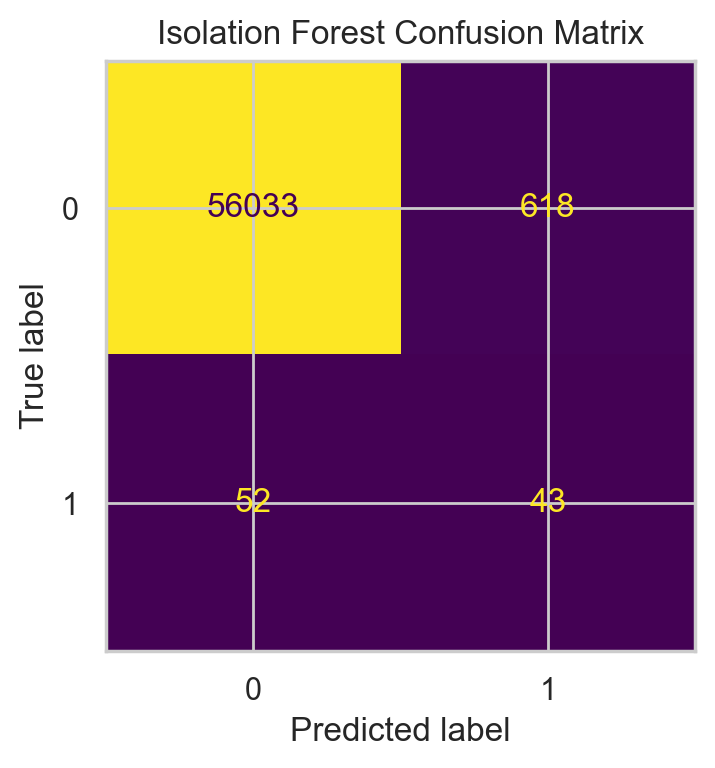

Figure 8. Isolation Forest confusion matrix.

Autoencoder confusion matrix:

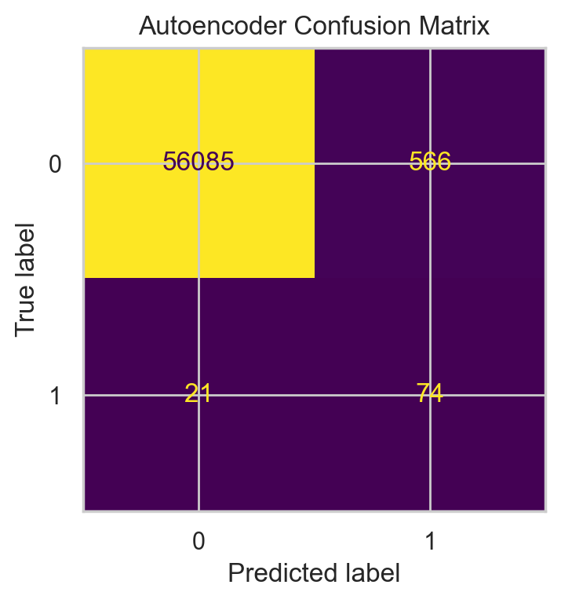

Figure 9. Autoencoder confusion matrix.

Explanation: Figures 8 and 9 show that anomaly models recover suspicious activity but with substantially higher false positives than supervised models, supporting their role as secondary monitoring layers.

While confusion matrices show one operating point, curve-based analysis is required to assess model behavior across threshold regions.

### 5.3 ROC and PR Curves

ROC and PR curves are included to avoid over-reliance on a single metric and to show ranking consistency across threshold behavior.

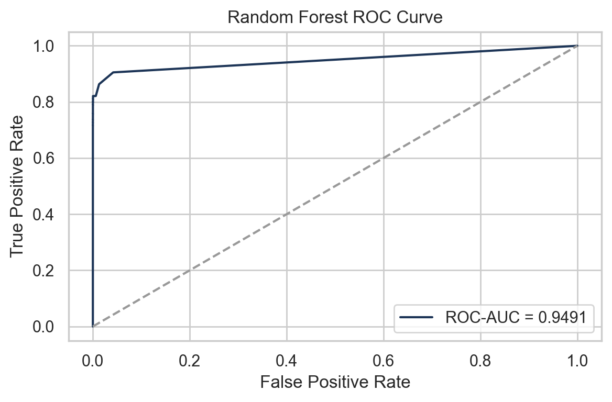

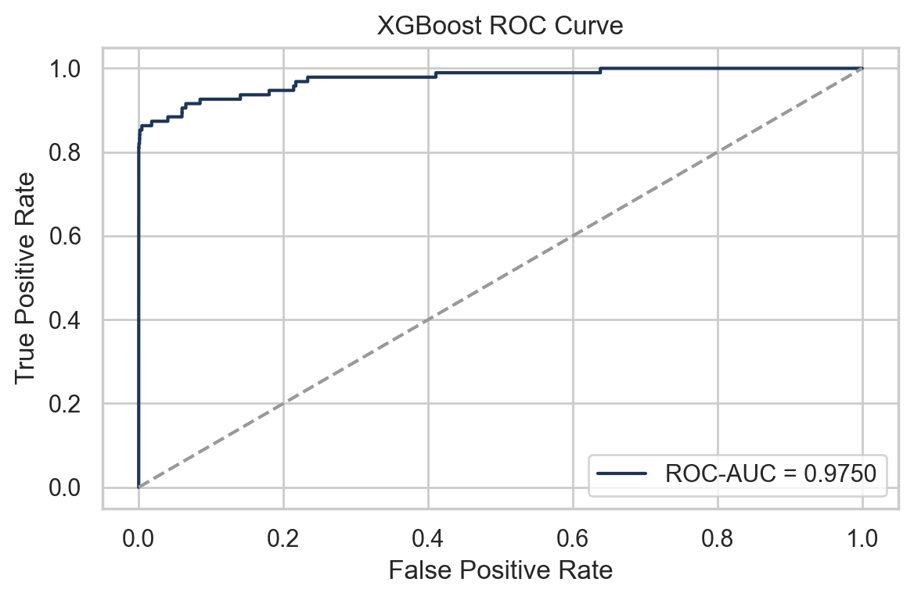

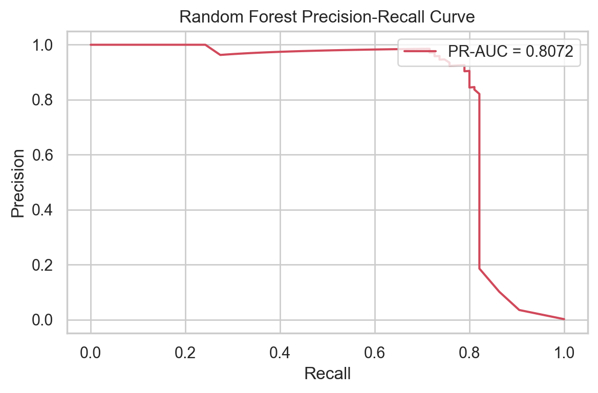

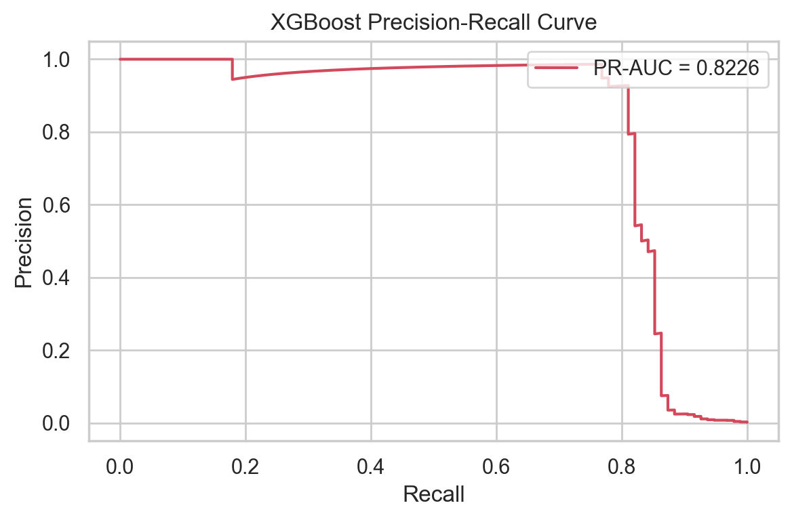

Figure 10. ROC and PR curves for the two supervised models.

Explanation: The PR curves are particularly informative under extreme imbalance. XGBoost maintains stronger precision-recall trade-offs across operating regions, which aligns with its superior F1 and PR-AUC in Table 1.

To verify that these observations are not split-specific, repeated cross-validation results are reported next.

### 5.4 Cross-Validation Robustness (5 folds x 3 seeds)

Table 2 reports repeated cross-validation statistics (mean plus-minus standard deviation) to assess reliability beyond one random split.

| Model | Precision Mean +/- Std | Recall Mean +/- Std | F1 Mean +/- Std | ROC-AUC Mean +/- Std | PR-AUC Mean +/- Std |
|---|---|---|---|---|---|
| XGBoost | 0.867619 +/- 0.030032 | 0.829436 +/- 0.045501 | 0.846980 +/- 0.022275 | 0.980059 +/- 0.011045 | 0.849230 +/- 0.044323 |
| Random Forest | 0.950230 +/- 0.021900 | 0.744912 +/- 0.060517 | 0.834087 +/- 0.043353 | 0.958067 +/- 0.015217 | 0.838988 +/- 0.044307 |
| Autoencoder | 0.160170 +/- 0.032255 | 0.746861 +/- 0.068926 | 0.262908 +/- 0.047254 | 0.936545 +/- 0.020096 | 0.468479 +/- 0.123071 |
| Isolation Forest | 0.091564 +/- 0.009955 | 0.572953 +/- 0.058125 | 0.157854 +/- 0.016820 | 0.948474 +/- 0.018327 | 0.116321 +/- 0.029270 |

Interpretation: Table 2 indicates that XGBoost not only ranks highest on mean F1, but also shows lower F1 variance than Random Forest, strengthening confidence in deployment stability.

Variance estimates alone, however, do not indicate whether differences are statistically meaningful, motivating the pairwise hypothesis tests in the next subsection.

### 5.5 Statistical Pairwise Comparison (Welch Test on F1)

Table 3 presents pairwise significance testing to determine whether observed performance gaps are likely due to random variation.

| Model Pair | Mean F1 Difference | t-statistic | p-value | Significant at 0.05 |
|---|---:|---:|---:|---|
| Random Forest vs XGBoost | -0.012892 | -1.024459 | 0.317325 | No |
| Random Forest vs Isolation Forest | 0.676233 | 56.322206 | 8.338041e-22 | Yes |
| Random Forest vs Autoencoder | 0.571179 | 34.496083 | 2.327129e-24 | Yes |
| XGBoost vs Isolation Forest | 0.689126 | 95.622144 | 1.056473e-34 | Yes |
| XGBoost vs Autoencoder | 0.584071 | 43.301224 | 3.452027e-21 | Yes |
| Isolation Forest vs Autoencoder | -0.105055 | -8.111813 | 2.466499e-07 | Yes |

Interpretation summary: XGBoost and Random Forest are both strong supervised candidates, and their F1 difference is not statistically significant in the repeated CV setting. At the same time, both supervised models significantly outperform unsupervised alternatives in F1, which supports cautious model selection statements and prevents overclaiming from point estimates alone.

These findings directly answer RQ1 and partially answer RQ2 by showing that supervised models dominate primary detection performance, while anomaly models are better positioned as complementary monitoring layers.

These empirical findings are interpreted in the next section through the lens of waqf operational policy, trust, and governance design.

---

## 6. Discussion

The discussion translates quantitative outcomes into deployment-relevant reasoning for digital waqf institutions.

### 6.1 Operational Trade-off for Digital Waqf
Results show a clear policy trade-off. XGBoost provides a stronger balance between fraud capture and false alarms, whereas Random Forest provides stricter false-positive control (FP = 1 on holdout) but with lower recall than XGBoost. Unsupervised models still detect anomalous behavior, although they are less suitable as primary high-precision detectors in this proxy setting.

Given this trade-off structure, governance interpretation must align model choice with institutional risk appetite.

### 6.2 Trust and Governance Interpretation
From a digital waqf governance perspective, XGBoost is suitable as a first-line model for broader fraud interception with controlled review burden, Random Forest functions as a conservative option when false accusation risk must be minimized, and Autoencoder together with Isolation Forest are better positioned for secondary monitoring of novel patterns and drift watchlisting.

Beyond policy alignment, transparency requirements also matter for reviewer confidence and implementation accountability.

### 6.3 Transparency Signal
Supervised feature importance indicates consistent leading variables across tree models (notably V14, V10, V12, and V4), which supports model behavior stability in the proxy feature space.

### 6.4 Governance and Trust Framework for Digital Waqf
To align with ICOP priorities, the empirical findings are translated into a governance-and-trust operating framework.

The proposed layered fraud detection architecture for digital waqf combines primary supervised scoring through XGBoost for first-pass detection, a precision safeguard through Random Forest for confirmation in high-impact decisions, anomaly surveillance through Autoencoder and Isolation Forest for emerging suspicious patterns, and a final human-governance review step by waqf compliance officers before account-level sanctions.

Figure 11. Governance and trust architecture for digital waqf fraud monitoring.

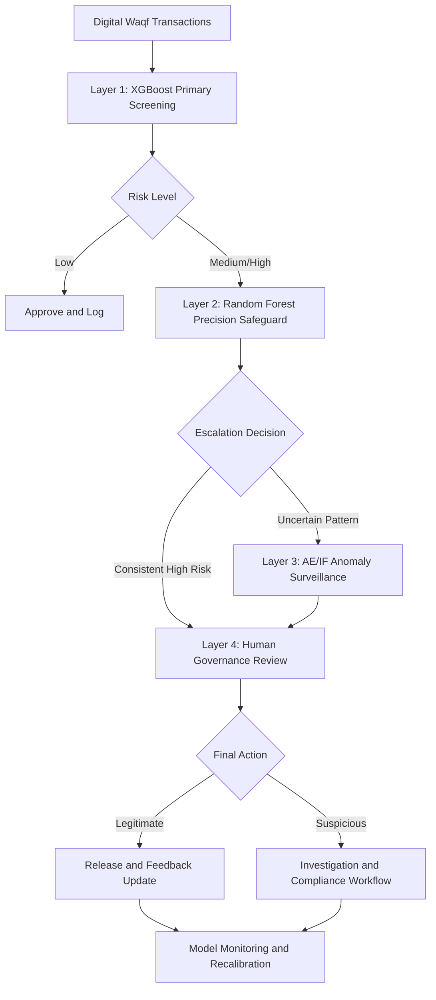

Explanation: Figure 11 shows that no single model is used as an autonomous sanction engine. Instead, model outputs are layered and governed, ensuring institutional oversight and reducing trust damage from isolated model errors.

Precision-trust trade-off interpretation: higher precision reduces wrongful alerts to legitimate donors and administrators, thereby preserving institutional trust, while higher recall reduces missed fraud events and strengthens governance integrity and financial accountability. The practical objective is therefore not to maximize a single metric, but to balance donor experience, review workload, and fraud-containment risk.

Operationally, this means XGBoost can be used for broad screening, while Random Forest supports conservative confirmation where false accusation cost is socially and reputationally high in waqf ecosystems.

Table 4 operationalizes this trade-off into governance controls.

| Governance Objective | Metric Emphasis | Recommended Layer | Operational Action |
|---|---|---|---|
| Preserve donor trust and reduce wrongful accusation | Precision | Random Forest safeguard + human review | Require manual confirmation before punitive actions |
| Minimize undetected fraud losses | Recall | XGBoost primary screening | Trigger rapid investigation queue for high-risk alerts |
| Detect novel or evolving fraud patterns | Anomaly sensitivity | Autoencoder and Isolation Forest | Maintain watchlist channel for non-routine suspicious behavior |
| Maintain institutional accountability | Balanced precision-recall governance | Layered architecture end-to-end | Keep auditable decision logs and periodic threshold recalibration |

This framework converts model metrics into governance policy levers, making the results directly usable for waqf platform operating procedures and addressing RQ3.

### 6.5 Deployment Architecture and Implementation Scenario
To move from experimental evidence to operational use, this section describes how the proposed models can be integrated into a digital waqf transaction system.

Figure 12. Deployment architecture for applied fraud monitoring in digital waqf.

Explanation: Figure 12 operationalizes the model stack into a production-like flow. XGBoost serves as a fast first-pass detector, anomaly models provide second-layer pattern checks, and human reviewers retain final authority for sanctions.

In waqf operations, implementation begins with a real-time entry point in which each transaction is scored immediately by the supervised model to minimize response delay. Risk-based branching then escalates only medium- and high-risk events to anomaly services, reducing unnecessary computational and review burden. Governance remains human-centered because account restriction, investigation, and compliance escalation are executed only after reviewer validation. Finally, reviewer outcomes are stored as feedback for periodic threshold recalibration and model-governance reporting.

This design is ICOP-relevant because it translates model performance into an implementable institutional workflow, embeds accountability by design through auditable logs and human-in-the-loop control, and directly protects trust by balancing fraud interception with false-accusation safeguards.

Despite these strengths, interpretation boundaries must be made explicit before drawing final conclusions.

---

## 7. Limitations and Validity

This section delineates the boundary between validated findings and claims that remain outside the evidence scope.

The dataset is a credit-card fraud proxy rather than waqf-native transaction data, and the anonymized feature space limits direct semantic interpretation for waqf-specific processes. External validity to real waqf systems therefore requires domain adaptation, threshold recalibration, and human-in-the-loop governance validation. Accordingly, this study should be interpreted as methodological-transfer and governance-design evidence, not as direct production deployment proof.

Within these constraints, the final section summarizes actionable conclusions that remain evidence-consistent.

---

## 8. Conclusion
This study demonstrates that machine learning can support trust-enhancing fraud monitoring design for digital waqf platforms in an extreme-imbalance setting. XGBoost shows the best overall calibrated performance, while Random Forest offers the strongest precision safeguard. Repeated stratified cross-validation and statistical testing improve reliability and reduce single-split bias. A practical recommendation is a layered monitoring architecture: supervised primary detection with unsupervised secondary anomaly surveillance. In relation to the research questions, RQ1 is addressed by the calibrated comparative results, RQ2 is addressed by the proposed layered role of anomaly models, and RQ3 is addressed by the deployment-oriented governance and trust framework.

To support independent verification, the next section lists direct links to the underlying artifacts used throughout this manuscript.

---

## 9. Reproducibility Assets
Readers can inspect the full artifact set through [results/tables/04_model_metrics.csv](results/tables/04_model_metrics.csv), [results/tables/05_final_model_comparison.csv](results/tables/05_final_model_comparison.csv), [results/tables/04b_cv_statistics.csv](results/tables/04b_cv_statistics.csv), [results/tables/05b_pairwise_comparison.csv](results/tables/05b_pairwise_comparison.csv), and [results/reports/05b_statistical_testing_report.txt](05b_statistical_testing_report.txt).

Finally, explicit drafting assumptions are stated to separate confirmed evidence from non-included publication components.

---

## 10. Explicit Assumptions and Gaps

This manuscript is written strictly from generated project artifacts, and no additional external empirical numbers were introduced. Literature review and novelty positioning are included using the project-available reference documents, and for journal submission the references list should be expanded with additional recent SINTA/Scopus-indexed studies while preserving all reported empirical values.

---

## 11. References

Arner, D. W., Barberis, J., and Buckley, R. P. (2015). The evolution of Fintech: A new post-crisis paradigm. Georgetown Journal of International Law, 47(4), 1271-1319.

Breiman, L. (2001). Random forests. Machine Learning, 45(1), 5-32.

Chandola, V., Banerjee, A., and Kumar, V. (2009). Anomaly detection: A survey. ACM Computing Surveys, 41(3), 1-58.

Chawla, N. V., Bowyer, K. W., Hall, L. O., and Kegelmeyer, W. P. (2002). SMOTE: Synthetic minority over-sampling technique. Journal of Artificial Intelligence Research, 16, 321-357.

Chen, T., and Guestrin, C. (2016). XGBoost: A scalable tree boosting system. Proceedings of the 22nd ACM SIGKDD International Conference on Knowledge Discovery and Data Mining, 785-794.

Davis, J., and Goadrich, M. (2006). The relationship between Precision-Recall and ROC curves. Proceedings of the 23rd International Conference on Machine Learning, 233-240.

Gomber, P., Kauffman, R. J., Parker, C., and Weber, B. W. (2018). On the Fintech revolution: Interpreting the forces of innovation, disruption, and transformation in financial services. Journal of Management Information Systems, 35(1), 220-265.

He, H., and Garcia, E. A. (2009). Learning from imbalanced data. IEEE Transactions on Knowledge and Data Engineering, 21(9), 1263-1284.

Liu, F. T., Ting, K. M., and Zhou, Z.-H. (2008). Isolation forest. Proceedings of the 8th IEEE International Conference on Data Mining, 413-422.

Oduro, D. A., Okolo, J. N., Bello, A. D., Ajibade, A. T., Fatomi, A. M., Oyekola, T. S., and Owoo-Adebayo, S. F. (2025). AI-powered fraud detection in digital banking: Enhancing security through machine learning. International Journal of Science and Research Archive, 14(03), 1412-1420. https://doi.org/10.30574/ijsra.2025.14.3.0854

Phua, C., Lee, V., Smith, K., and Gayler, R. (2010). A comprehensive survey of data mining-based fraud detection research. arXiv:1009.6119.

Saito, T., and Rehmsmeier, M. (2015). The Precision-Recall plot is more informative than the ROC plot when evaluating binary classifiers on imbalanced datasets. PLOS ONE, 10(3), e0118432.

Vangibhurathachhi, S. K. (2025). Machine Learning for Fraud Detection in Financial Transactions. International Journal on Science and Technology (IJSAT), 16(1).
